# Tugas Lab 8 Web

## Profil
| # | Biodata |
| -------- | --- |
| **Nama** | Reza Riyaldi Irawan |
| **NIM** | 312010284 |
| **Kelas** | TI.20.A.2 |
| **Mata Kuliah** | Pemrograman Web |

## Langkah 1 `Persiapan`
1. Jalankan control panel XAMPP.
2. Klik start pada Apache dan MySQL.

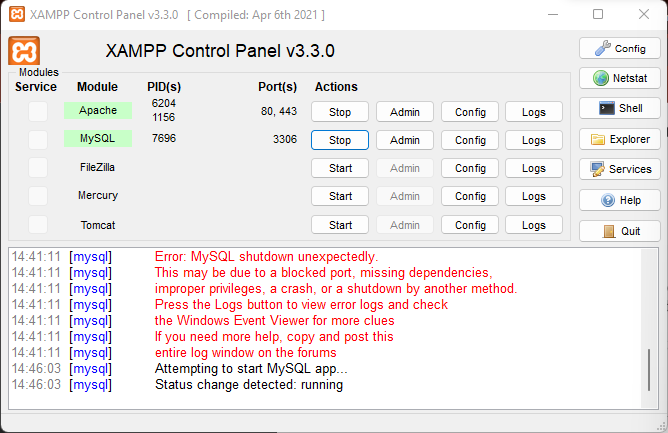

3. Apabila sudah jalan. Buka [http://localhost/phpmyadmin](http://localhost/phpmyadmin) untuk membuka phpmyadmin.

## Langkah 2 `Membuat Database`
1. Klik navigasi `SQL` lalu jalankan query berikut.

```sql
CREATE DATABASE db_barang;
```

2. Apabila seperti gambar berikut maka sudah berhasil.

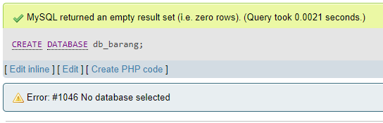

## Langkah 3 `Membuat Table`
1. Klik navigasi `SQL` lalu jalankan query berikut.

```sql
USE db_barang;
CREATE TABLE tb_barang(
    id_barang int(11) PRIMARY KEY AUTO_INCREMENT,
    nama_barang varchar(30) NOT NULL,
    kategori_barang varchar(30) NOT NULL,
    gambar_barang text NOT NULL,
    harga_beli decimal(10,0) NOT NULL,
    harga_jual decimal(10,0) NOT NULL,
    stok int(4) NOT NULL

```

2. Apabila seperti gambar berikut maka sudah berhasil.

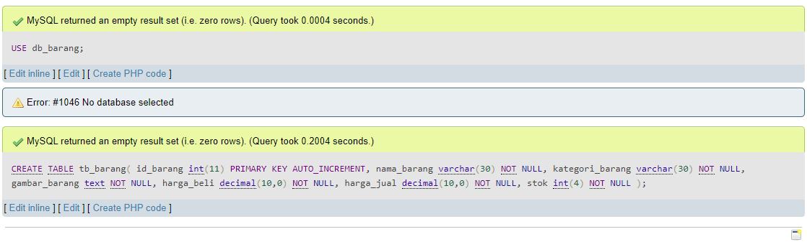

## Langkah 3 `Insert Data`
1. Klik navigasi `SQL` lalu jalankan query berikut.

```sql
INSERT INTO `tb_barang` (`id_barang`, `nama_barang`, `kategori_barang`, `gambar_barang`, `harga_beli`, `harga_jual`, `stok`) VALUES (NULL, 'Gayung', 'Alat rumah tangga', 'gambar/gayung.jpg', '5000', '10000', '10'), (NULL, 'Laptop', 'Elektronik', 'gambar/laptop.jpg', '3800000', '4000000', '4');
```

2. Apabila seperti gambar berikut maka sudah berhasil.

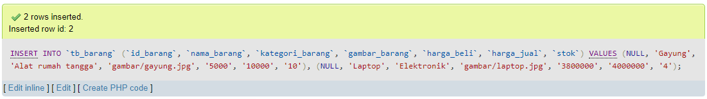


## Langkah 4 `Membuat Program CRUD`
1. Buat folder `Lab8Web` di direktori htdocs.
2. Buat file dengan nama `koneksi.php`, lalu tambahkan kode berikut.

```php
<?php
$koneksi = mysqli_connect('localhost', 'root', '', 'db_barang');

if ($koneksi == false) {
    echo "Koneksi gagal";
    die();
} 

var_dump($koneksi);
```

3. Apabila seperti gambar berikut maka berhasil.

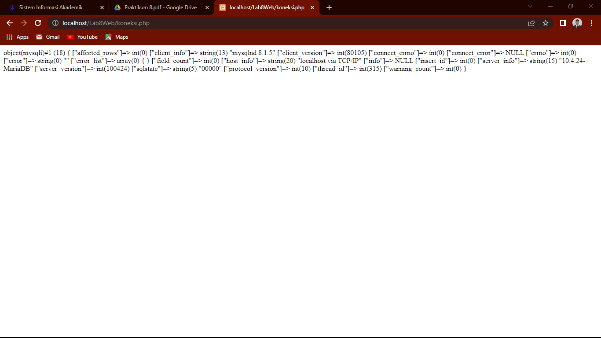

## Langkah 5 `Tampil Data (READ)`
1. Buat file `index.php`, lalu tambahkan kode berikut.

```php
<?php
include "koneksi.php";

$query = "SELECT * FROM tb_barang";
$result = mysqli_query($koneksi, $query);
?>

<!DOCTYPE html>
<html lang="en">

<head>
    <meta charset="UTF-8">
    <meta http-equiv="X-UA-Compatible" content="IE=edge">
    <meta name="viewport" content="width=device-width, initial-scale=1.0">
    <title>CRUD Sederhana</title>

    <link rel="stylesheet" href="https://cdn.jsdelivr.net/npm/bootstrap@5.2.0-beta1/dist/css/bootstrap.min.css">
</head>

<body>
    <div class="container">
        <h1 class="my-3 text-center">Data Barang</h1>
        <a href="tambah.php" class="btn btn-success btn-sm mb-3">Tambah Barang</a>

        <table class="table table-sm table-bordered">
            <tr class="text-center fw-bold text-uppercase">
                <td>No</td>
                <td>Gambar</td>
                <td>Nama</td>
                <td>Kategori</td>
                <td>Harga Beli</td>
                <td>Harga Jual</td>
                <td>Stok</td>
                <td>Aksi</td>
            </tr>
            <?php
            if ($result->num_rows > 0) {
                
                // die();
                $no = 1;
                while ($data = mysqli_fetch_array($result)) {
                    // var_dump($data['nama_barang']);
            ?>
                    <tr>
                        <td class="text-center"><?= $no++ ?></td>
                        <td class="text-center">" alt="gabisa" width="200px"></td>
                        <td><?= $data['nama_barang'] ?></td>
                        <td><?= $data['kategori_barang'] ?></td>
                        <td>Rp. <?= $data['harga_beli'] ?></td>
                        <td>Rp. <?= $data['harga_jual'] ?></td>
                        <td><?= $data['stok'] ?></td>
                        <td class="text-center">
                            <a href="#" class="btn btn-warning btn-sm mx-1">Edit</a><a href="#" class="btn btn-danger btn-sm mx-1">Delete</a>
                        </td>
                    </tr>
                <?php
                }
            } else {
                ?>
                <tr>
                    <td colspan="8" class="text-center">Data Kosong</td>
                </tr>
            <?php
            }
            ?>
        </table>
    </div>
</body>

</html>
```

2. Maka hasilnya akan seperti berikut.

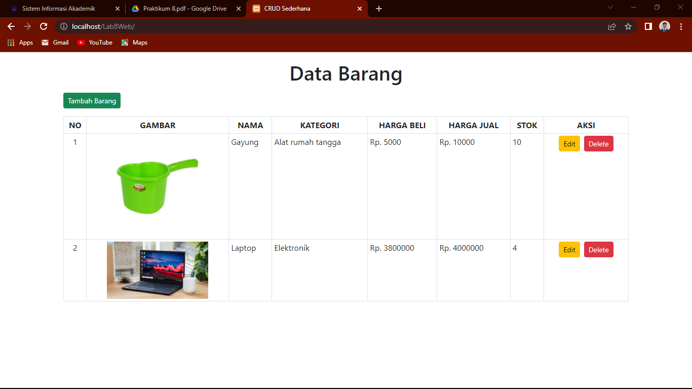

## Langkah 6 `Tambah Data (CREATE)`
1. Buat file baru bernama `tambah.php`, lalu tambahkan kode berikut.

```html
<!DOCTYPE html>
<html lang="en">

<head>
    <meta charset="UTF-8">
    <meta http-equiv="X-UA-Compatible" content="IE=edge">
    <meta name="viewport" content="width=device-width, initial-scale=1.0">
    <title>CRUD Sederhana | CREATE</title>

    <link rel="stylesheet" href="https://cdn.jsdelivr.net/npm/bootstrap@5.2.0-beta1/dist/css/bootstrap.min.css">
</head>

<body>
    <div class="container">
        <div class="row m-0">
            <div class="col-md-5 mx-auto">
                <div class="card mt-3">
                    <div class="card-header text-center">
                        <h3>Tambah Barang</h3>
                    </div>
                    <div class="card-body">
                        <form action="proses.php" method="post">
                            <div class="mb-3">
                                <label for="nama_barang" class="form-label">Nama Barang</label>
                                <input type="text" name="nama_barang" id="nama_barang" placeholder="Masukan nama barang" class="form-control">
                            </div>
                            <div class="mb-3">
                                <label for="kategori_barang" class="form-label">Kategori Barang</label>
                                <input type="text" name="kategori_barang" id="kategori_barang" placeholder="Masukan kategori barang" class="form-control">
                            </div>

                            <label for="harga_beli" class="form-label">Harga Beli</label>
                            <div class="input-group mb-3">
                                <span class="input-group-text">Rp.</span>
                                <input type="number" name="harga_beli" id="harga_beli" placeholder="Masukan Harga Beli" class="form-control">
                            </div>

                            <label for="harga_jual" class="form-label">Harga Jual</label>
                            <div class="input-group mb-3">
                                <span class="input-group-text">Rp.</span>
                                <input type="number" name="harga_jual" id="harga_jual" placeholder="Masukan Harga Jual" class="form-control">
                            </div>

                            <div class="mb-3">
                                <label for="stok" class="form-label">Stok</label>
                                <input type="number" class="form-control" name="stok" placeholder="Masukan Stok Barang">
                            </div>

                            <div class="mb-3">
                                <label for="gambar" class="form-label">Gambar</label>
                                <input type="file" name="gambar_barang" id="gambar" class="form-control form-control-sm">
                            </div>

                            <a href="index.php" class="btn btn-secondary">Kembali</a>
                            <button class="btn btn-success" type="submit">Tambah</button>
                        </form>
                    </div>
                </div>
            </div>
        </div>
    </div>
</body>

</html>
```

2. Maka tampilannya akan seperti berikut.

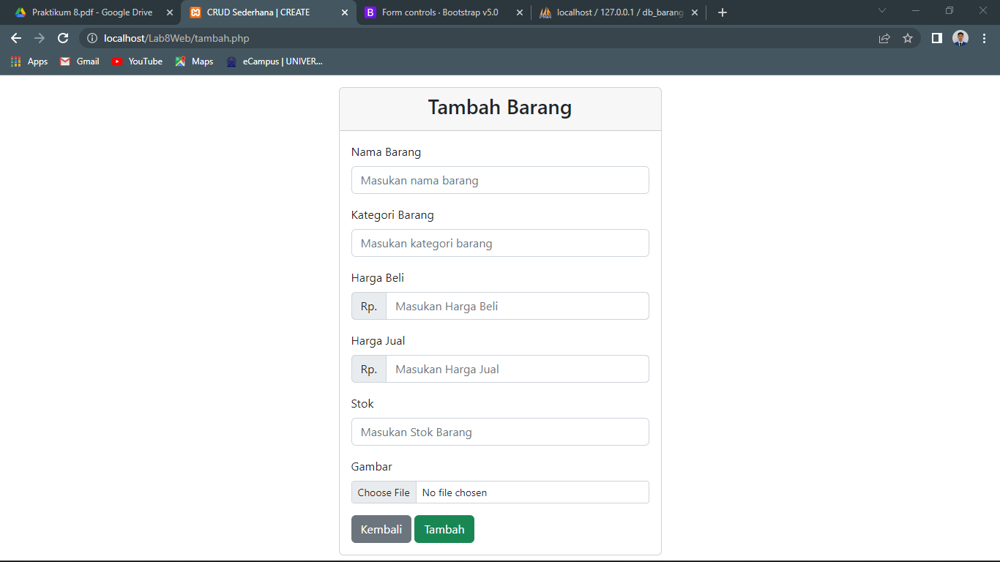

3. Tambahkan file baru dengan nama `proses.php` yang dimana ini difungsikan sebagai proses semuanya.

4. Tambahkan kode berikut pada file `proses.php`.

```php
<?php
include "koneksi.php";

if ($_SERVER["REQUEST_METHOD"] == "POST") {
    // -- Tambah Barang -- 
    if (isset($_POST['tambah'])) {
        $input = (object) $_POST;
        // var_dump($input); die();

        $nama_barang = ucwords(strtolower($input->nama_barang));
        $kategori_barang = ucwords(strtolower($input->kategori_barang));
        $harga_beli = $input->harga_beli;
        $harga_jual = $input->harga_jual;
        $stok = $input->stok;
        $file_gambar = $_FILES['gambar_barang'];
        $gambar = NULL;
        
        if ($file_gambar['error'] == 0) {
            $nama_gambar = str_replace(' ', '_', $file_gambar['name']);
            $path = dirname(__FILE__) . '/gambar/' . $nama_gambar;

            if (move_uploaded_file($file_gambar['tmp_name'], $path)) {
                $gambar = $nama_gambar;
            }
        }
        
        $query = "INSERT INTO tb_barang (nama_barang, kategori_barang, harga_beli, harga_jual, stok, gambar_barang) ";
        $query .= "VALUE ('$nama_barang', '$kategori_barang', '$harga_beli', '$harga_jual', '$stok', '$gambar') ";
        
        $result = mysqli_query($koneksi, $query);
        
        header('location:index.php');
        
    }
    // -- END Tambah Barang -- 
}
```

5. Apabila berhasil maka data baru sukses ditambahkan.

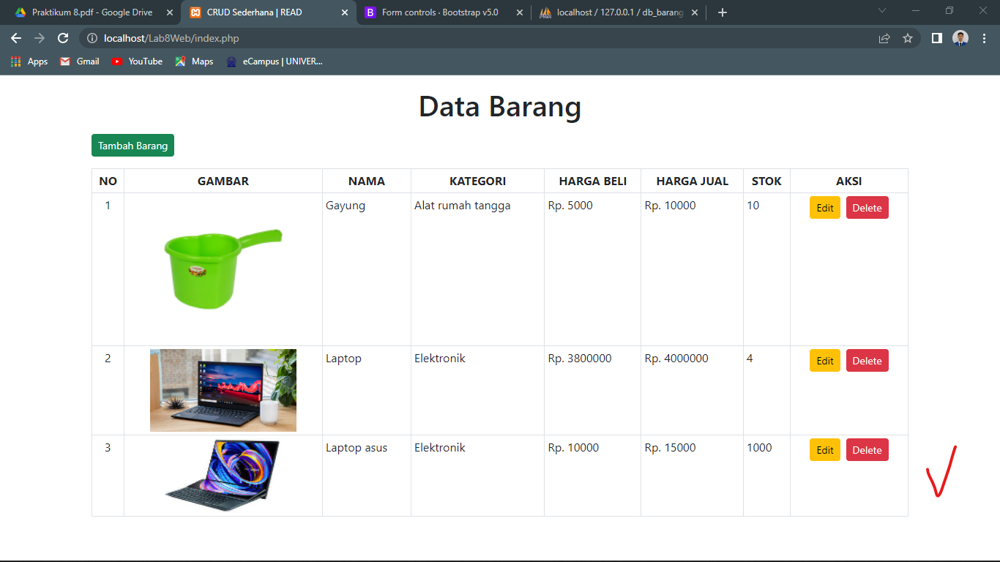

## Langkah 7 `Ubah Data (UPDATE)`
1. Buat file baru dengan nama `ubah.php`, lalu tambahkan kode berikut.

```php
<!DOCTYPE html>
<html lang="en">

<head>
    <meta charset="UTF-8">
    <meta http-equiv="X-UA-Compatible" content="IE=edge">
    <meta name="viewport" content="width=device-width, initial-scale=1.0">
    <title>CRUD Sederhana | UPDATE</title>

    <link rel="stylesheet" href="https://cdn.jsdelivr.net/npm/bootstrap@5.2.0-beta1/dist/css/bootstrap.min.css">
</head>

<body>
    <div class="container">
        <div class="row m-0">
            <div class="col-md-5 mx-auto">
                <div class="card mt-3">
                    <div class="card-header text-center">
                        <h3>Ubah Barang</h3>
                    </div>
                    <div class="card-body">
                        <?php
                        include "koneksi.php";

                        $id = $_GET['id_barang'];
                        $query = "SELECT * FROM tb_barang ";
                        $query .= "WHERE id_barang = $id";

                        $result = mysqli_query($koneksi, $query);
                        $data = mysqli_fetch_array($result);
                        ?>
                        <form action="proses.php" method="post" enctype="multipart/form-data">
                            <div class="mb-3">
                                <label for="nama_barang" class="form-label">Nama Barang</label>
                                <input type="text" name="nama_barang" id="nama_barang" placeholder="Masukan nama barang" class="form-control" value="<?= $data['nama_barang'] ?>">
                            </div>
                            <div class="mb-3">
                                <label for="kategori_barang" class="form-label">Kategori Barang</label>
                                <input type="text" name="kategori_barang" id="kategori_barang" placeholder="Masukan kategori barang" class="form-control" value="<?= $data['kategori_barang']?>">
                            </div>

                            <label for="harga_beli" class="form-label">Harga Beli</label>
                            <div class="input-group mb-3">
                                <span class="input-group-text">Rp.</span>
                                <input type="number" name="harga_beli" id="harga_beli" placeholder="Masukan Harga Beli" class="form-control" value="<?= $data['harga_beli']?>">
                            </div>

                            <label for="harga_jual" class="form-label">Harga Jual</label>
                            <div class="input-group mb-3">
                                <span class="input-group-text">Rp.</span>
                                <input type="number" name="harga_jual" id="harga_jual" placeholder="Masukan Harga Jual" class="form-control" value="<?= $data['harga_jual']?>">
                            </div>

                            <div class="mb-3">
                                <label for="stok" class="form-label">Stok</label>
                                <input type="number" class="form-control" name="stok" placeholder="Masukan Stok Barang" value="<?= $data['stok']?>">
                            </div>

                            <div class="mb-3">
                                <label for="gambar" class="form-label">Gambar</label>
                                <input type="file" name="gambar_barang" id="gambar" class="form-control form-control-sm" value="<?= $data['gambar_barang']?>">
                            </div>

                            <a href="index.php" class="btn btn-secondary">Kembali</a>
                            <button class="btn btn-warning" name="ubah" type="submit">Ubah</button>
                        </form>
                    </div>
                </div>
            </div>
        </div>
    </div>
</body>

</html>
```

2. Maka hasilnya akan seperti berikut.

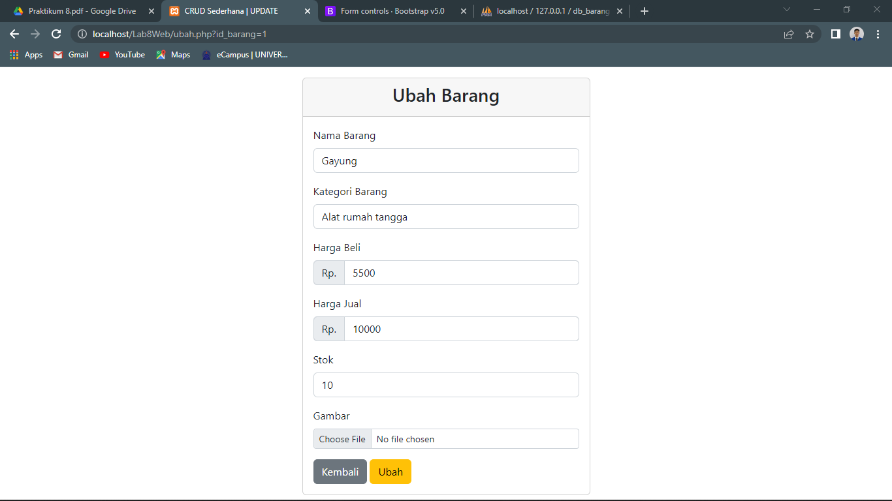
3. Perlu diperhatikan pada `index.php` di tombol edit, href nya harus mengarah file `ubah.php` dengan membawa parameter `id_barang`, seperti berikut.

```php
<a href="ubah.php?id_barang=<?= $data['id_barang'] ?>" class="btn btn-warning btn-sm mx-1">Edit</a>
```

3. Pada `proses.php` tambahkan kode berikut.

```php
// -- Ubah Barang -- 
    } else if (isset($_POST['ubah'])) {
        $input = (object) $_POST;
        
        $nama_barang = ucwords(strtolower($input->nama_barang));
        $kategori_barang = ucwords(strtolower($input->kategori_barang));
        $harga_beli = $input->harga_beli;
        $harga_jual = $input->harga_jual;
        $stok = $input->stok;
        $file_gambar = $_FILES['gambar_barang'];
        $gambar = NULL;

        if ($file_gambar['error'] == 0) {
            $nama_gambar = str_replace(' ', '_', $file_gambar['name']);
            $path = dirname(__FILE__) . '/gambar/' . $nama_gambar;

            if (move_uploaded_file($file_gambar['tmp_name'], $path)) {
                $gambar = $nama_gambar;
            }
        }
        
        $query = "UPDATE tb_barang SET nama_barang = '$nama_barang', kategori_barang = '$kategori_barang', harga_beli = '$harga_beli', harga_jual = '$harga_jual', stok = '$stok'";

        if (!empty($gambar)) {
            $query .= ", gambar_barang = '$gambar' ";
        }
        $query .= "WHERE id_barang = $input->id_barang";
        
        $result = mysqli_query($koneksi, $query);
        
        header('location:index.php');

        // -- END Ubah Barang --
    }
```

## Langkah 8 `Hapus Barang (DELETE)`
1. Pada tombol delete ubah hrefnya ke `proses.php` dengan membawa 2 parameter yaitu id_barang dan aksi serta tambahkan atribut onclick agar ketika tidak sengaja terklik tidak langsung terhapus, seperti berikut.

```php
<a href="proses.php?id_barang=<?= $data['id_barang'] ?>&aksi=hapus" class="btn btn-danger btn-sm mx-1" onclick="return confirm('Apakah anda yakin ingin menghapus <?= $data['nama_barang'] ?> ?')">Delete</a>
```
2. Maka ketika diklik akan seperti berikut.

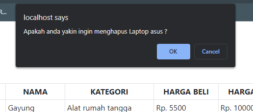

3. Pada file `proses.php` tambahkan kode berikut.

```php
// -- END POST ACTION --
    // -- Hapus barang --
} else if (isset($_GET['id_barang']) && $_GET['aksi'] == "hapus") {

    $id = $_GET['id_barang'];
    $query = "DELETE FROM tb_barang WHERE id_barang = $id";

    $result = mysqli_query($koneksi, $query);

    header('location:index.php');

} // -- END Hapus Barang
```

4. Maka ketika berhasil menghapus data barang akan seperti berikut.

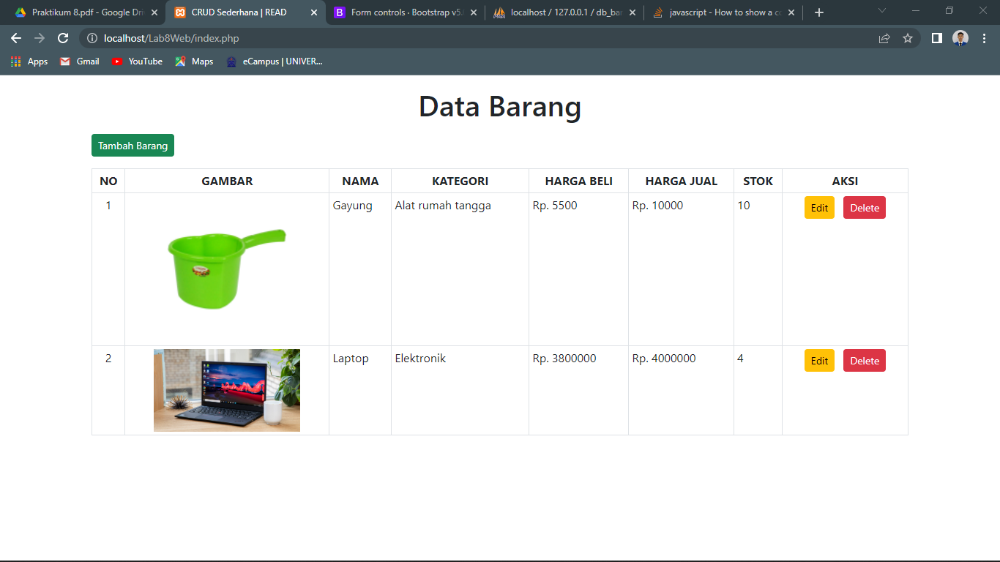